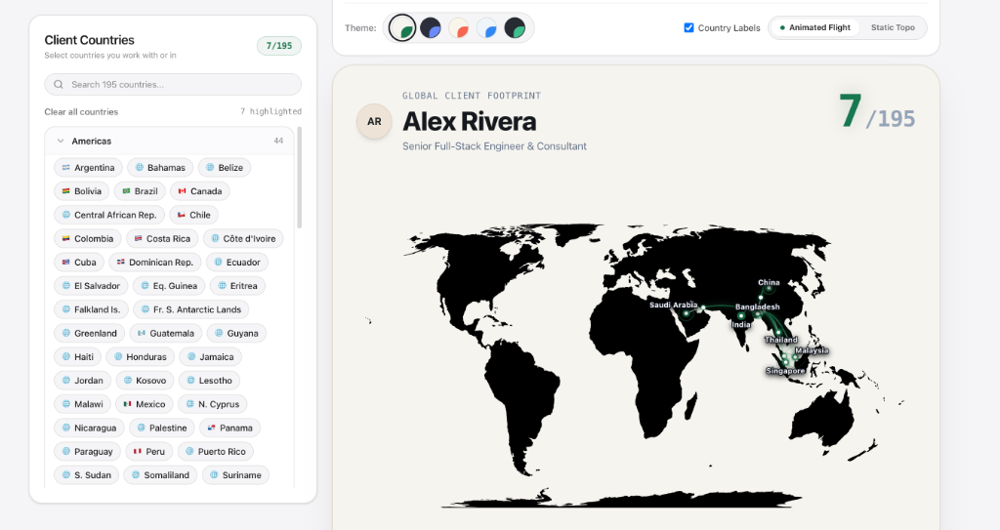
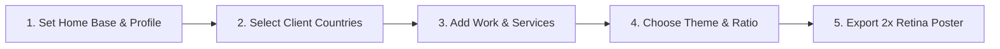

<div align="center">

# 🌍 yourmap.me
### **Show the world where you work.**

A privacy-first, aesthetic infographic generator for freelancers, independent consultants, agencies, and global specialists to showcase their international client footprint and professional scope of work.

[](https://react.dev/)
[](https://www.typescriptlang.org/)
[](https://tailwindcss.com/)
[](https://vitejs.dev/)
[](https://yourmap.me)
[](LICENSE)

<br />



<br />

[**Website Demo**](https://yourmap.me) · [**Report Issue**](https://github.com/amrjim77-code/yourmap.me/issues) · [**Created by A M R JIM**](https://www.linkedin.com/in/al-mahamud-rohit-jim-8027b9275/)

</div>

---

## 📖 About yourmap.me

**yourmap.me** empowers tech specialists, creative studios, remote freelancers, and cross-border agencies to transform their client roster into high-converting visual proof. 

Instead of traditional text bullet points, **yourmap.me** visualizes your international reach on an interactive, high-definition world map with origin-radiating flight arcs, global market coverage analytics, and categorized service matrices. With a single click, export crisp, 2x Retina-quality posters tailored for LinkedIn carousels, portfolio decks, and client proposals.

---

## ✨ Key Features

### 🗺️ 1. Interactive Global Client Reach Map
- **195 Country Coverage**: Search, filter by continent, or click to toggle any country on an SVG TopoJSON world projection.
- **Home Base Origin & Flight Paths**: Select where you are working from (e.g., Bangladesh, United Kingdom, USA, Germany) to render glowing geodesic flight arcs connecting directly to each client territory.
- **Market Coverage Metrics**: Real-time counter of total countries served, percentage of the world covered, and continents reached.

### 💼 2. Scope of Work & Capability Matrix
- **Tailored Services**: Highlight your core deliverables (Design, Engineering, Consulting, Marketing, Logistics).
- **Custom Service Adder**: Seamlessly add niche specialties with custom tags that match your branding.

### 🎨 3. Curated Designer Color Palettes
- **Glacier & Azure Blue**: Crisp, high-contrast modern tech aesthetic.
- **Emerald Luxe**: Clean prestige green with glowing accents.
- **Midnight Obsidian**: Deep dark-mode theme with vibrant neon highlights.
- **Sunset Rose & Coral**: Warm, creative gradient and coral tones.
- **Deep Ocean**: Rich nautical navy with turquoise illumination.

### 📸 4. 2x Retina High-Resolution Export
- **Social Media Ready**: Export 1:1 (Square) or 4:5 (Portrait) framed posters formatted for LinkedIn, X (Twitter), and Instagram.
- **Artifact-Free Graphics**: Clean rasterization engine generating pixel-perfect PNG and JPG downloads with zero shadow smudges.

### 🔒 5. 100% Private by Design (Zero Database)
- **Local Browser Storage Only**: Your name, role, photo, and client records are stored exclusively in your browser's local memory (`localStorage`).
- **No External Servers**: Zero database storage, zero tracking cookies, zero ads, and zero third-party data collection.

---

## 🚀 How to Use yourmap.me



1. **Set Up Your Profile**:
   - Upload your profile photo or company logo.
   - Type your name and professional title (e.g., *Senior Full-Stack Consultant*).
   - Set your **Starting Point (Home Base)** where your work originates from.
2. **Select Your Client Countries**:
   - Use the continent accordion or search bar to highlight the countries you've worked with.
   - Watch the animated connection arcs illuminate the globe.
3. **Customize Your Scope of Work**:
   - Select your core offerings or add custom service tags in the *What You Do* tab.
4. **Choose Your Aesthetics**:
   - Pick between 5 color palettes and switch between **1:1** or **4:5** aspect ratios.
5. **Download & Share**:
   - Click **Download PNG** or **Download JPG** to get your high-resolution infographic ready to post on LinkedIn and your portfolio.

---

## 🛠️ Tech Stack

- **Framework**: [React 18](https://react.dev/) + [TypeScript](https://www.typescriptlang.org/)
- **Build Tool**: [Vite 8](https://vitejs.dev/)
- **Styling**: [Tailwind CSS](https://tailwindcss.com/)
- **Map Visualizations**: [react-simple-maps](https://www.react-simple-maps.io/) + [TopoJSON](https://github.com/topojson/topojson)
- **Graphics Export**: [html-to-image](https://github.com/bubkoo/html-to-image) + [canvas-confetti](https://github.com/catdad/canvas-confetti)
- **Icons**: [Lucide React](https://lucide.dev/)

---

## 💻 Running Locally

### Prerequisites
- [Node.js](https://nodejs.org/) (version 18 or newer)
- npm, yarn, or bun

### Installation

1. **Clone the repository**:
   ```bash
   git clone git@github.com:amrjim77-code/yourmap.me.git
   cd yourmap.me
   ```

2. **Install dependencies**:
   ```bash
   npm install
   ```

3. **Start the local development server**:
   ```bash
   npm run dev
   ```
   Open [http://localhost:3000](http://localhost:3000) in your browser.

4. **Build for production**:
   ```bash
   npm run build
   ```

---

## 👨‍💻 Creator & Attribution

Created & designed with care by **A M R JIM**:
- **LinkedIn**: [al-mahamud-rohit-jim](https://www.linkedin.com/in/al-mahamud-rohit-jim-8027b9275/)
- **Facebook**: [A M R JIM](https://www.facebook.com/share/1FgP4jNFEG/)

---

## 📄 License

This project is open-source under the [MIT License](LICENSE).
Feel free to use and customize it to showcase your global client reach!
